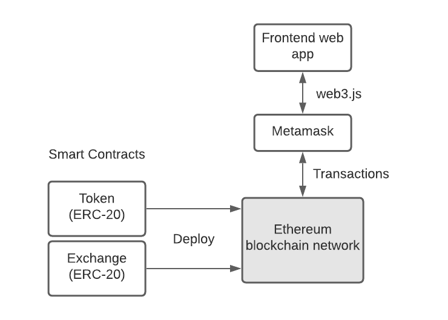

# eth-swap-tutorial

A tutorial from DApp University for setting up a custom ERC-20 token and a cryptocurrency exchange.

## DApp Univesity blockchain tutorial video

https://www.youtube.com/watch?v=99pYGpTWcXM

## App Architecture



## Setup (macOS)

1. Install Xcode, launch, and accept the T&C

2. Install Node (via nvm)

    ```
    curl -o- https://raw.githubusercontent.com/nvm-sh/nvm/v0.38.0/install.sh | bash
    nvm install 9.10.0
    ```

3. Install Ganache (Truffle Suite, one-click blockchain that runs locally)

    a) Download, install, and run the quickstart: https://www.trufflesuite.com/ganache  
    b) Click the 'Settings' Gear -> 'Server' tab, and set the Network ID to: ```1337``` (see bug linked in the sources)
    c) Restart the blockchain

4. Install Truffle framework (Smart contract dev framework to create Ethereum contracts with the Solidity language. It can also write tests against the contracts, and deploy them to the blockchain)

    ```
    npm install --g truffle@5.1.14
    ```

5. Clone the starter project

    ```
    git clone https://github.com/dappuniversity/eth_swap eth-swap
    ```

6. Install identicon lib

    ```
    cd eth-swap
    npm install --save identicon.js@^2.3.3
    ```

7. Set up Metamask digital wallet. Metamask is used to connect the browser to the blockchain (either the local Ganache network and the main Ethereum network), store, and transfer ETH and ERC-20 tokens. Download and install the chrome extension, then create an account.

    https://metamask.io/

## Run the Truffle Migrations

Migrations are JavaScript files that help you deploy contracts to the Ethereum network. These files are responsible for staging your deployment tasks, and they're written under the assumption that your deployment needs will change over time. As your project evolves, you'll create new migration scripts to further this evolution on the blockchain. A history of previously run migrations is recorded on-chain through a special Migrations contract, detailed below.

Run the command:
```
truffle migrate
```

Add the ```--reset``` flag to run from the beginning:
```
truffle migrate --reset
```

## Migration Details

```1_initial_migration.js```  
Deploy a smart contract named 'Migrations' that holds an owner address and the last completed migration number.

```2_deploy_contracts.js```  
Deploy a Token contract and an EthSwap contract (represents the exchange). Transfer the entire balance from the Token contract to the EthSwap contract. The exchange now has the entire balance.

## EthSwap Contract Implementation

1. First write tests to verify behavior.
    * Token contract is deployed
    * EthSwap contract is deployed
    * EthSwap contract has tokens
    * EthSwap allows buying and selling Tokens for ETH with balance validations

2. Implement the EthSwap ```buyTokens()``` and ```sellTokens()``` methods.
    * Buying: Sender transfers ETH to the EthSwap and receives Tokens
    * Selling: Sender transfers Tokens to the EthSwap and receives ETH

3. Run ```truffle test``` to verify tests pass

4. Run ```truffle migrate --reset``` to build and deploy contracts to the blockchain

## Connect the browser and React app to the blockchain

1. Serve the React app locally on port 3000 by running:

        npm run start

2. Then load the URL in the browser:  
    http://localhost:3000/

3. Connect the browser to the local Ganache blockchain through the Metamask extension.

    First in Metamask, import the private key of the **first** account in the Ganache accounts list (To find the accounts private key, click the 'Key' button on the right in Ganache)

    Click the 'Networks' dropdown in the top-middle and select **Custom RPC** to add the Ganache network. See Ganache settings for URL and Chain ID values.
    * Network Name: Ganache
    * New RPC URL: http://localhost:7545
    * Chain ID: 1337

    Now click connect and verify it shows as 'Connected' in the upper-left.

4. Connect the app to the local Ganache blockchain.

    In the App.js React component, the web3.js library is used to connect to the blockchain, load the Token and EthSwap smart contracts (using the ABI artifacts), and buy/sell Tokens with ETH.

    The web3.js library connects to the blockchain through Metamask.
    When a buy or sell request is made, it opens a confirmation screen in Metamask with the transaction details. The web3.js methods provide callbacks so the React app knows when the transaction is approved or rejected.

## Credits

https://github.com/dappuniversity/eth_swap  
https://www.youtube.com/channel/UCY0xL8V6NzzFcwzHCgB8orQ  

## Sources

https://www.trufflesuite.com/docs/truffle/getting-started/running-migrations  
https://web3js.readthedocs.io/en/v1.2.11/web3-utils.html#towei  
https://ethereum.stackexchange.com/questions/253/  
https://github.com/trufflesuite/ganache-core/issues/575 (Ganache network/chain ID mismatch bug)  
